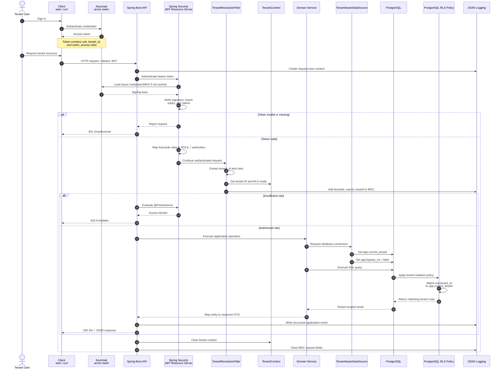
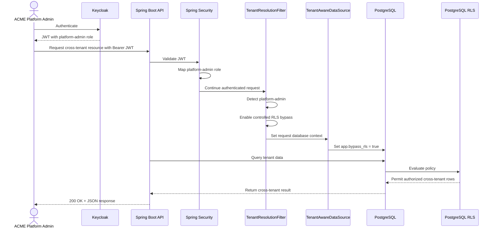

# ACME Multitenant SaaS POC

A production-shaped (but intentionally minimal) multitenant SaaS backend for fictitious
B2B company **ACME**, built with Spring Boot, PostgreSQL Row-Level Security (RLS), and
Keycloak-based RBAC.

## Domain model

| Entity | Scope | Notes |
|---|---|---|
| `tenants` | platform-admin managed | ACME's customer companies |
| `users` | tenant-scoped (RLS) | seeded local projection of the demo Keycloak principals |
| `products` | tenant-scoped (RLS) | each tenant's own catalog — main RLS demo entity |
| `plans` | global, no RLS | ACME's own pricing tiers: Starter/Professional/Enterprise |
| `subscriptions` | tenant-scoped (RLS) | links a tenant to a plan |

## Multitenancy: how RLS isolation works

1. `TenantResolutionFilter` reads the `tenant_id` claim (and `platform-admin` role) from the
   validated JWT and stores it in a `TenantContext` ThreadLocal for the request.
2. `TenantAwareDataSource` wraps the Hikari pool; every time Spring checks out a physical
   connection for a transaction it runs `SET LOCAL app.current_tenant = '<uuid>'` and
   `SET LOCAL app.bypass_rls = 'true'/'false'`.
3. Postgres RLS policies on `users`, `products`, `subscriptions` restrict every row to
   `tenant_id = current_setting('app.current_tenant')` unless `app.bypass_rls = 'true'`
   (platform-admin).
4. Because `SET LOCAL` only lasts for the current transaction, **every service method that
   touches these tables must be `@Transactional`** — otherwise no tenant is set and RLS
   returns zero rows.
5. The app connects as a dedicated non-superuser/non-owner role (`acme_app`) and tables use
   `FORCE ROW LEVEL SECURITY`, so RLS can't be silently bypassed.

RLS is the primary isolation control. `@PreAuthorize` role checks are defense-in-depth on
top, not a substitute for it.

## Typical request flow

The normal tenant-user request flows from Keycloak authentication through JWT validation,
tenant-context resolution, role authorization, and PostgreSQL RLS filtering.



## Platform-admin request flow

Platform administrators use the same JWT validation path, but the `platform-admin` role
enables the controlled cross-tenant RLS bypass for platform administration endpoints.



## RBAC / Keycloak

Realm `acme` (declaratively imported from
[`src/main/resources/keycloak/realm-export.json`](src/main/resources/keycloak/realm-export.json)):

| Role | Description |
|---|---|
| `platform-admin` | ACME staff, cross-tenant access, manages tenants |
| `tenant-admin` | Manages their own tenant's products/subscription |
| `tenant-user` | Read/write own tenant's products only |

Each tenant user has a `tenant_id` user attribute, exposed in the access token via a custom
protocol mapper on the `acme-cli` client.

### Sample tenants & users (seeded)

| Tenant | User | Password | Role |
|---|---|---|---|
| — | `admin@acme.io` | `Passw0rd!` | `platform-admin` |
| Northwind Traders | `alice@northwind.example` | `Passw0rd!` | `tenant-admin` |
| Northwind Traders | `bob@northwind.example` | `Passw0rd!` | `tenant-user` |
| Globex Industries | `carol@globex.example` | `Passw0rd!` | `tenant-admin` |

> The `acme-cli` client uses the OAuth2 **password grant** purely so these demo users can be
> tested with `curl`. Don't use password grant for real browser-based clients — use
> Authorization Code + PKCE there instead.

## Running locally

```bash
docker compose up --build
```

This starts Postgres, Keycloak (realm auto-imported), and the app. Wait for
`GET http://localhost:8080/actuator/health` to return `{"status":"UP"}`.

## Trying it out

```bash
# Get a token for a Northwind tenant-admin
TOKEN=$(curl -s -X POST http://localhost:8081/realms/acme/protocol/openid-connect/token \
  -d grant_type=password -d client_id=acme-cli \
  -d username=alice@northwind.example -d password=Passw0rd! | jq -r .access_token)

# List Northwind's own products (RLS-filtered)
curl -s http://localhost:8080/api/products -H "Authorization: Bearer $TOKEN" | jq

# Platform-admin can list all tenants
ADMIN_TOKEN=$(curl -s -X POST http://localhost:8081/realms/acme/protocol/openid-connect/token \
  -d grant_type=password -d client_id=acme-cli \
  -d username=admin@acme.io -d password=Passw0rd! | jq -r .access_token)
curl -s http://localhost:8080/api/admin/tenants -H "Authorization: Bearer $ADMIN_TOKEN" | jq
```

## Testing

```bash
mvn verify
```

Runs unit tests plus Testcontainers-backed integration tests that spin up real Postgres +
Keycloak containers, importing the same realm file, and assert:
- a tenant only ever sees its own products/users/subscription (RLS isolation)
- a platform-admin can see across all tenants (bypass_rls)
- role-based endpoint access is enforced (`tenant-user` forbidden from admin/create endpoints)
- unauthenticated requests are rejected

Requires a running Docker daemon.

## Structured logging

All logs are emitted as single-line JSON (`logstash-logback-encoder`) to stdout, including
`traceId`, `tenantId`, and `userId` MDC fields set per-request, e.g.:

```json
{"@timestamp":"...","level":"INFO","message":"tenant_created","tenantId":"...","service":"acme-multitenant-saas"}
```

## Project layout

```
src/main/java/com/acme/saas/
  tenant/        # platform-admin managed tenants
  user/          # tenant-scoped seeded user projection
  product/       # tenant-scoped product catalog (RLS demo)
  plan/          # global ACME pricing plans
  subscription/  # tenant <-> plan subscriptions
  security/      # TenantContext, TenantAwareDataSource, SecurityConfig, JWT handling
  config/        # DataSource wiring
  common/        # shared exceptions + RFC7807 error handling
src/main/resources/db/migration/   # Flyway migrations (schema + RLS policies + seed data)
src/main/resources/keycloak/       # realm-export.json (roles, groups, demo users)
```

## Production-readiness notes / next steps

- Actuator exposes `health`, `info`, `metrics`, `flyway` (not fully public — see `SecurityConfig`).
- Graceful shutdown enabled (`server.shutdown=graceful`).
- Secrets (DB/Keycloak passwords) are read from environment variables, not committed — swap
  in a real secrets manager (Vault, AWS/Azure secrets manager) before production use.
- No tracing/metrics-export/dashboards included by design (kept to JSON logs + Actuator for
  this POC) — add OpenTelemetry + Prometheus/Grafana for real production observability.
- The `acme_owner` migration role and `acme_app` runtime role are separate on purpose — never
  run the app as the schema owner or a superuser, or RLS is silently bypassed.
